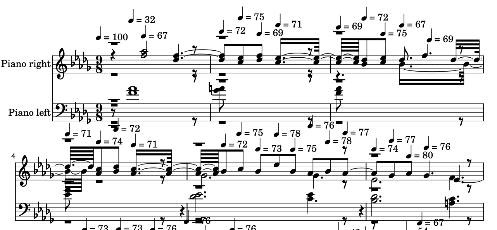

# Intro to LilyPond

## What is LilyPond?

LilyPond is a programming language for bridging the gap between MIDI files and "readable" code.

LilyPond allows for direct control over all 127 MIDI modular controls (pitch bend/sustain pedal/which bank to use/etc...)

LilyPond has very odd syntax.  
Here is an example of Clair De Lune:

```ly
trackBchannelB = \relative c {
  \voiceThree
  r4 <f'' aes >2 <des f > <ees c >8 <f des > <c ees >8*7 
  | % 3
  <bes des >8 <c ees > des8. f4. des16*5 

```

* LilyPond is specifically made for converting *STRICT* midi files to staff paper
  * Not live performance
    * Live performance MIDI tracks are known for their wonky interpretation of Tempo
      * Changing the almost every note as a way to convert the emotional variable tempo

Here is an example of converting the Clair De Lune (live performance)

`midi2ly Claire_de_line.mid`

Notice how the tempo markings and "Piano left" and "Piano right" are weird

My LilyPond VSCode extension includes an autocompile to MIDI and pdf when editing .ly files, hence the second midi.

The original MIDI is labeled `Clare_de_Lune.mid`, with the autogenerated being tilted `Claire_de_Lune-midi.midi`
